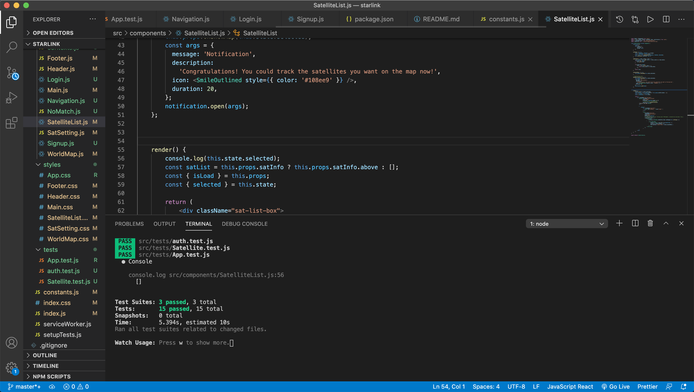

## This is an ITP 404 Final README file from Zhongyu Li.

 

## Final Project Sketch

### *General Idea*

Generally, this project is an application that provides **satellite tracking and viewing functionality on a global scope**. Nowadays, satellites are common in space and play an important role in space exploration and communication on our planet. My application is aimed to provide search and track functions on a 2-Dimension world map for users to check and view the **Starlink** satellites at any location or altitude that they are interested in.

### *Resources*

The satellite data or API used in this project are from [N2YO.COM](https://www.n2yo.com), which provides real time tracking and pass predictins of satellites with orbital paths and footprints overlaid on Google Maps.

While [Starlink](https://www.starlink.com) is a satellite internet constellation constructed by SpaceX providing satellite Internet access. The constellation consists thousands of mass-produced small satellites in low erath orbit. My application focused on providing tracking and viewing service for these satellites.

 

---

## The Application files in *src* folder:

- The components for this project are all included in the *components* folder. 
 
The main functions for the application could be generally separated for the following parts:

  - World Map visualization in **WorldMap.js**
  - Satellite settings (list, time and duration) in **SatSetting.js** and **SatelliteList.js**
  - Fetch satellite and render them on map in **Main.js**
  - Custom form validation in **Signup.js**, **Login.js**, **Navigation.js**, **auth.js** and **context.js**
  - Other includes 404 no match page in **NoMatch.js** and page design in **Header.js** and **Footer.js** 

- Any KEY or Base URL of the N2YO.COM REST API v1 accessed from [N2YO.COM](https://www.n2yo.com) with a registered account to provide data to build this real time satellite tracking application are all included in **constant.js**. (outside the *components* folder)

- The CSS style files are all included in the *styles* folder.

- Some image assets like the StarLink logo used for the APP are included in the *assets* folder.

 

---

## Deploy Site:

### *1. ITP404 Final Project (StarLink)*

- Final Project GitHub public repo URL: [https://github.com/CyberToRover/ITP404-Final](https://github.com/CyberToRover/ITP404-Final)

  - including all application files 

- React frontend on Netlify Domain: [https://cybertorover-itp404-final.netlify.app](https://cybertorover-itp404-final.netlify.app)
  
  - deployed by command line

  - *netlify.toml* file is used to link to Heroku and fix page not found problem for the deployment on Netlify

- JSON Server API on Heroku deployment site: [https://zhongyuli-itp404-final.herokuapp.com/](https://zhongyuli-itp404-final.herokuapp.com/) 

  - JSON Server URL on Heroku: 
     - Users JSON: [https://zhongyuli-itp404-final.herokuapp.com/api/users](https://zhongyuli-itp404-final.herokuapp.com/api/users)
  
     - Login JSON: [https://zhongyuli-itp404-final.herokuapp.com/api/login](https://zhongyuli-itp404-final.herokuapp.com/api/login)

---

### *2. ITP404 Final API (StarLink-API)*

- Final API GitHub public repo URL: [https://github.com/CyberToRover/ITP404-Final-StarLink-API](https://github.com/CyberToRover/ITP404-Final-StarLink-API)

- StarLink-API on Heroku deployment site: [https://dashboard.heroku.com/apps/zhongyuli-starlink-api](https://dashboard.heroku.com/apps/zhongyuli-starlink-api)
  
  - Check the Final project StarLink API settings for application which database (PostgreSQL) is attached. And this should be same as the settings in .env file in Adonis project for the starlink-api. 

---

### *3. ITP404 Final Demo (StarLink)*

- Final Project Demo Video URL:

---
### **Instruction**:
Open Netlify domain and JSON Server URL on Heroku to check all the functions of the application. The information and data generated when users sign up, login or logout would be recorded on JSON Server on Heroku. Refresh the JSON Server URL deployed on Heroku each time after operation (AJAX request) to see the updates of JSON there for those actions made in custom form validation.

 

---
## Screenshots of some results in application:

### Main Page Demo:
 

### Netlify Deploy log:
 

### Heroku Build log:
 

### API Heroku DB Credentials:
 

### Terminal of tests:
 

